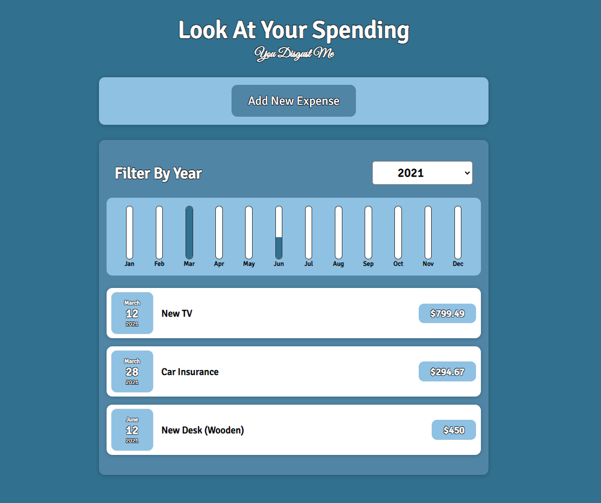
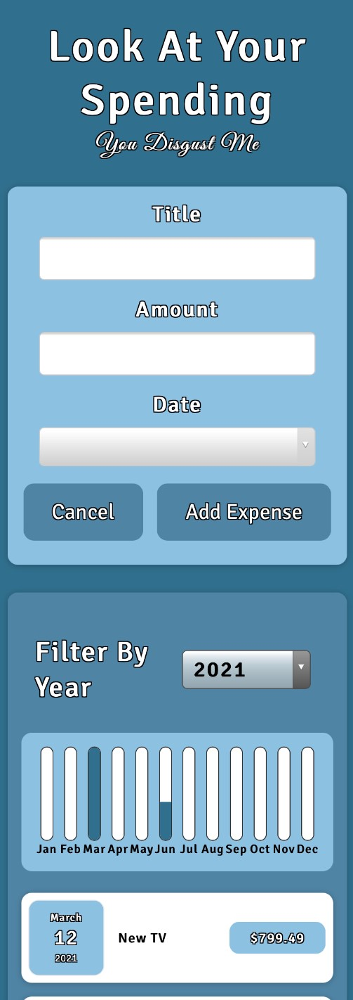

# Expense-Tracker
This app keeps track of your expenses and has an animated bar chart to give you a visual representation of your spending
month to month so you can quickly see if the spending in a month is problematic. You can add a new expense as well as 
filter to show only expenses of a given year or all of your expenses. 

Made with react.

This is the app's homescreen on a regular pc.

To add a new expense.

On mobile.

